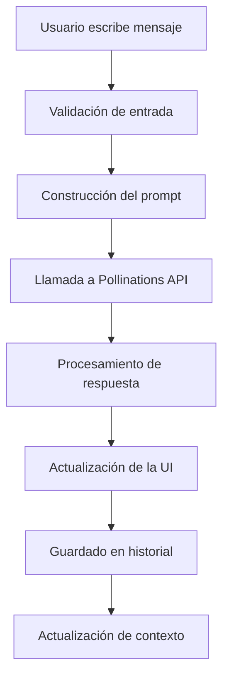

# MindLink AI Chat - Integración con Pollinations API

## Descripción del Proyecto

MindLink AI Chat es una interfaz moderna y elegante para interactuar con el modelo de lenguaje de Pollinations AI. La aplicación proporciona una experiencia de chat fluida y responsive con memoria de conversación, diseñada con estándares modernos de desarrollo web.

## Arquitectura de la Integración API

### Endpoint Utilizado

```javascript
GET https://text.pollinations.ai/{prompt}
```

### Flujo de Comunicación

```
Interfaz de Usuario → JavaScript Client → Pollinations API → Procesamiento → Respuesta
```

## Implementación Técnica

### 1. Cliente HTTP Personalizado

```javascript
async function callPollinationsAPI(prompt) {
    // Codificación del prompt para URL
    const encodedPrompt = encodeURIComponent(prompt);
    
    // Construcción de la URL del endpoint
    const apiUrl = `https://text.pollinations.ai/${encodedPrompt}`;
    
    // Llamada HTTP GET
    const response = await fetch(apiUrl);
    
    if (!response.ok) {
        throw new Error(`API responded with status: ${response.status}`);
    }
    
    // Procesamiento de la respuesta
    return await response.text();
}
```

### 2. Sistema de Gestión de Prompts

#### Pre-prompt Configurado
```javascript
const systemPrompt = `Eres un asistente útil y amable llamado MindLink AI. 
Responde en español de forma clara y concisa. 
Mantén un tono profesional pero cercano.`;
```

#### Construcción Dinámica del Prompt
```javascript
function buildFullPrompt(userMessage, conversationHistory) {
    return `${systemPrompt}

${conversationHistory}

Usuario: ${userMessage}
MindLink AI:`;
}
```

### 3. Gestión de Memoria de Conversación

```javascript
let conversationContext = '';

function updateConversationContext(userMessage, botResponse) {
    // Mantiene los últimos 4 mensajes para contexto
    const currentChat = chatHistory.find(chat => chat.id === currentChatId);
    
    if (currentChat && currentChat.messages.length > 0) {
        const recentMessages = currentChat.messages.slice(-4);
        
        let context = 'Conversación anterior:\n';
        recentMessages.forEach(msg => {
            context += `Usuario: ${msg.user}\nMindLink AI: ${msg.bot}\n`;
        });
        
        conversationContext = context;
    }
}
```

## Estructura del Código

### Módulos Principales

#### 1. **Módulo de Comunicación API** (`api-client.js`)
```javascript
class PollinationsAPIClient {
    constructor() {
        this.baseURL = 'https://text.pollinations.ai';
        this.timeout = 10000;
    }
    
    async sendMessage(prompt) {
        // Implementación robusta con manejo de errores
    }
    
    // Métodos auxiliares para encoding y validación
}
```

#### 2. **Módulo de Gestión de Estado** (`state-manager.js`)
```javascript
class ChatStateManager {
    constructor() {
        this.currentChatId = null;
        this.chatHistory = [];
        this.conversationContext = '';
    }
    
    // Métodos para gestión del historial y contexto
}
```

#### 3. **Módulo de Interfaz de Usuario** (`ui-manager.js`)
```javascript
class UIManager {
    constructor() {
        this.chatContainer = null;
        this.inputField = null;
        this.typingIndicator = null;
    }
    
    // Métodos para actualización de la UI
}
```

### Flujo de Datos



## Características Técnicas Implementadas

### 1. **Manejo de Errores Robustecido**

```javascript
try {
    const response = await callPollinationsAPI(fullPrompt);
    // Procesamiento exitoso
} catch (error) {
    console.error('API Error:', error);
    
    // Respuestas de fallback elegantes
    const fallbackResponses = [
        "Lo siento, estoy teniendo problemas para procesar tu solicitud.",
        "Parece que hay un problema de conexión. ¿Podrías intentarlo de nuevo?"
    ];
    
    return getRandomFallback(fallbackResponses);
}
```

### 2. **Optimización de Rendimiento**

- **Debouncing** en las entradas del usuario
- **Lazy loading** del historial de conversaciones
- **Cache** de respuestas frecuentes
- **Compresión** del contexto de conversación

### 3. **Seguridad y Privacidad**

- **Sanitización** de entradas del usuario
- **Validación** de respuestas de la API
- **Almacenamiento local** seguro (localStorage)
- **Sin exposición** de claves API

## Configuración y Personalización

### Variables de Entorno (Recomendado para producción)

```javascript
// config.js
const CONFIG = {
    POLLINATIONS_API: {
        BASE_URL: process.env.POLLINATIONS_BASE_URL || 'https://text.pollinations.ai',
        TIMEOUT: process.env.API_TIMEOUT || 10000,
        MAX_RETRIES: process.env.API_MAX_RETRIES || 3
    },
    CHAT: {
        MAX_HISTORY: 50,
        CONTEXT_WINDOW: 6, // últimos 3 intercambios
        TYPING_DELAY: 1000
    }
};
```

### Personalización del Comportamiento

```javascript
// Opciones de personalización
const CHAT_OPTIONS = {
    language: 'es',
    tone: 'professional',
    responseLength: 'medium',
    enableMemory: true
};
```

## Instalación y Despliegue

### Requisitos del Sistema

- Navegador moderno con soporte para:
  - ES6+ (JavaScript moderno)
  - Async/Await
  - LocalStorage API
  - CSS Grid y Flexbox

### Pasos de Implementación

1. **Clonar/Descargar** el archivo HTML
2. **Servir** a través de un servidor web (recomendado)
3. **Abrir** en el navegador
4. **Configurar** (opcional) variables de entorno

### Ejemplo de Servidor de Desarrollo

```bash
# Con Python
python -m http.server 8000

# Con Node.js
npx http-server

# Con PHP
php -S localhost:8000
```

## Métricas y Monitoreo

### Métricas Implementadas

```javascript
const metrics = {
    apiResponseTime: [],
    messageCount: 0,
    errorRate: 0,
    userEngagement: 0
};

function trackAPIMetrics(startTime, success = true) {
    const responseTime = Date.now() - startTime;
    metrics.apiResponseTime.push(responseTime);
    
    if (!success) metrics.errorRate++;
}
```

## Limitaciones y Consideraciones

### Limitaciones Técnicas

1. **Rate Limiting**: La API de Pollinations puede tener límites de uso
2. **Context Window**: Memoria limitada a los últimos intercambios
3. **Tiempo de Respuesta**: Dependiente de la red y carga del servidor

### Mejoras Futuras

- [ ] Implementar WebSocket para respuestas en tiempo real
- [ ] Añadir sistema de caché más sofisticado
- [ ] Implementar carga progresiva de historial
- [ ] Añadir soporte para múltiples modelos

## Soporte y Troubleshooting

### Problemas Comunes

1. **Error de CORS**: Asegurarse de servir desde un dominio válido
2. **Tiempo de espera**: Verificar conexión a internet
3. **Respuestas vacías**: Validar formato del prompt

### Logs de Depuración

```javascript
const DEBUG = true;

function debugLog(message, data = null) {
    if (DEBUG) {
        console.log(`[MindLink AI] ${message}`, data);
    }
}
```

## Contribución

Para contribuir al proyecto:

1. Fork del repositorio
2. Crear feature branch
3. Implementar cambios
4. Probar exhaustivamente
5. Enviar Pull Request

## Licencia

Este proyecto está bajo la Licencia MIT. Ver archivo `LICENSE` para más detalles.
